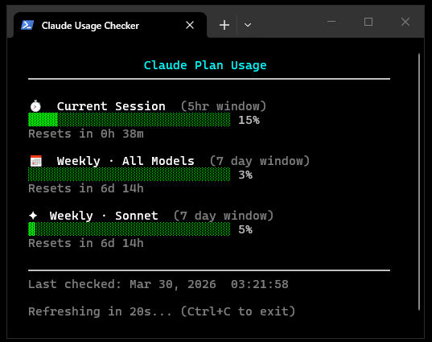

<div align="center">


# Claude Usage CLI

**Monitor your Claude.ai usage limits in real time — from your terminal**

<br>


</div>

---

## 📸 Preview

<p align="center">
  
</p>

---

## 🧠 Overview

Claude Usage CLI provides a fast, minimal way to track your current session and weekly usage without opening a browser.

It displays live usage metrics with visual indicators and automatic refresh.

---

## ✨ Features

- 📊 Real-time usage tracking
- 📅 Session and weekly usage breakdown
- 🟢🟡🔴 Color-coded status indicators
- ⏳ Countdown timers for reset windows
- 🔄 Auto-refresh every 20 seconds
- 🌐 Cloudflare-compatible via `curl_cffi`

---

## 📁 Project Structure

```
.
├── main.py
├── .env.example
├── .env          # local only (ignored)
├── README.md
├── requirements.txt
└── .gitignore
```

---

## ⚙️ Setup

### 1. Clone the repository

```bash
git clone https://github.com/30Sana/claude-usage-cli
cd claude-usage-cli
```

### 2. Install dependencies

```bash
pip install -r requirements.txt
```

### 3. Configure environment variables

```bash
cp .env.example .env
```

Edit `.env`:

```
CLAUDE_ORG_ID=your-org-id-here
CLAUDE_SESSION_KEY=your-session-key-here
CLAUDE_DEVICE_ID=your-device-id-here
CLAUDE_ANON_ID=your-anon-id-here
```

---

## 🔐 How to Obtain Credentials

1. Open https://claude.ai/settings/usage
2. Open Developer Tools (`F12`)
3. Go to the **Network** tab
4. Refresh the page
5. Find a request to:

```
/api/organizations/.../usage
```

6. Right-click → **Copy as cURL**

Extract:

- `sessionKey` (cookie)
- `anthropic-device-id`
- `anthropic-anonymous-id`
- Organization ID (from URL)

---

## ▶️ Usage

```bash
python main.py
```

Auto-refresh runs every 20 seconds.

---

## ⚠️ Notes

- `sessionKey` expires periodically — refresh when needed
- Relies on internal APIs that may change

---

## 📦 Requirements

- Python 3.8+
- curl_cffi
- python-dotenv

---

## 🔒 Security

- Do not share credentials
- Rotate session values if exposed

---

## 📄 License

MIT License

---

<div align="center">

Made for developers who prefer terminals over tabs.

</div>
